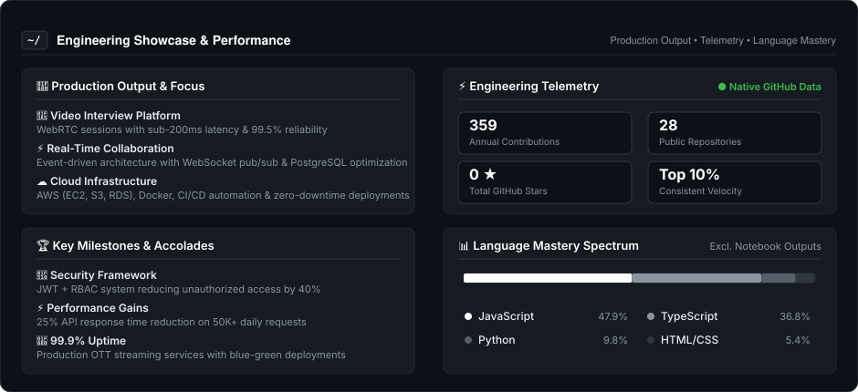

  
  
    

  # Avinash Kumar
  
  

    
  

  ### 🚀 Building Scalable Backend & Real-Time Systems
  
  **Full-Stack Engineer • Backend Specialist • DevOps Enthusiast**

   

  
  &nbsp;
  

---

### 👨‍💻 About Me

I'm a **Software Engineer** with 2+ years building and operating production backend and real-time systems. I focus on reliable, well-tested APIs, measurable performance gains, and clean, maintainable code delivered in collaborative Agile teams.

* 🔧 **Currently:** Architecting production-grade Video Interview Platforms with WebRTC and building event-driven real-time collaboration systems.
* ☁️ **Cloud Focus:** AWS infrastructure (EC2, S3, RDS), Docker containerization, and CI/CD automation with GitHub Actions.
* 💼 **Experience:** 2+ years across TheRegiment and Enveu Software Technologies, building scalable backend services and OTT streaming platforms.
* 🤝 **Open To:** DevOps Engineer, SRE, Backend SDE, and Full-Stack Developer roles in product companies and startups.

---

### 📡 Technical Capability & Skills Radar

  

---

### 🛠️ Core Tooling & Technologies

| **Category** | **Technologies** |
| :--- | :--- |
| **Backend & APIs** |  |
| **Web Development** |  |
| **Cloud & DevOps** |  |
| **Tools & Platforms** |  |

---

### 📈 Activity & Contribution Flow

  

---

### ⚡ Engineering Showcase & Performance

  

---

### 🎮 The Human Side

I'm not just a code machine. When the IDE closes, here is who I am:

* **🎯 Current Focus:** Building production systems with WebRTC, real-time collaboration, and cloud infrastructure.
* **📚 Always Learning:** System design, Kubernetes orchestration, and distributed systems architecture.
* **💡 Philosophy:** I believe in writing clean, maintainable code with measurable impact and zero-downtime deployments.

---

  Building reliable systems, one API at a time. Let's create something impactful together.

